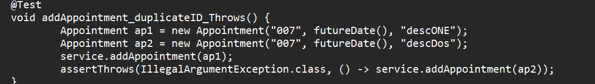

**CS 320 Project Two: Summary and Reflection**

Dylan P. Harmon

CS 320: Software Test, Automation QA

Rob Tuft

October 19, 2025

The feature overview for this project includes four primary feature
areas across the three mobile application domains: Appointment, Task,
and Contact. The tested behaviors cover: (1) object construction and
validation of required fields/length limits; (2) mutability and
defensive behavior of accessors and mutators; and (3) in-memory service
management (such as add, get, update, delete) including uniqueness for
ID and existence checks. The unit tests used use strategies such as
happy and unhappy path behavior and boundary cases.

Feature 1 -- Object Creation and Validation:

- My Approach: happy-path constructor test and ample invalid-constructor
  tests (including null/blank/too-long id/ past date). Setter tests
  verify acceptance of valid values and the rejection of invalid values,
  plus creating a defensive copy.

- In reference to AppointmentTest.java, Evidence for constructor and
  invalid constructor tests
  **Successfull_Constructor_CreatesAppointment(),
  Constructor_NULLInvalid_Throws(),
  constructor_NullOrPast_Date_Throws(),
  constructor_NullOrInvalid_Desc_Throws().** Defensive copy tests
  (**getAppointmentDate_ReturnsDefensiveCopy()**) and negative setter
  tests (**setters_ValidInput_DoesNotThrow()**).

Feature 2 -- Storage and Management

- Approach: service-level tests for add/get/delete, including null
  checks, id validation (simulating bad getId()), duplicate id
  prevention, and expected exceptions for missing entries.

- Evidence (AppointmentService): addAppointment_NULL_Throws(),
  addAppt_InvalidID_Throws() (anonymous subclass simulating bad id),
  addAppointment_duplicateID_Throws(),
  addAndGetAppointment_Successfull(), and deletion tests.

{width="6.5in"
height="0.9173611111111111in"}{width="6.5in"
height="1.9902777777777778in"}

Feature 3 -- Mutability

- Approach: Unit tests validate constructor behavior and field
  constraints. In Task the constraints include id ≤ 10 characters, name
  ≤ 20 characters, and description ≤ 50 characters. Validation is
  conducted with positive and negative tests to verify that the setters
  mutability rules and immutable id behave as intended.

- Evidence:

  - TaskTest constructor and invalid-field tests (InvalidTaskIdThrows(),
    InvalidNameThrows(), InvalidDescriptionThrows()), setter tests
    (SuccessfullSetName, InvalidSetName, SuccessfullSetDescription,
    InvalidSetDescription), and TaskService tests for add/delete/update
    behaviors (SuccessfullAddTask, DuplicateAddTaskThrows,
    SuccessfullUpdateTaskNameAndDescription,
    InvalidUpdateTaskFieldsThrows).

Feature 4 -- Contact Creation, mutability, and ContactService
management:

- Approach: Contact unit tests validate id/name/phone/address
  constraints which in addition to the Task constraints include phone
  must be exactly 10 digits, and address must be ≤ 30 characters.

- Evidence: ContactTest valid and invalid constructor tests
  (ValidContactCreation, InvalidContactIdThrows, FirstNameInvalidThrows,
  etc.), setter negative tests (SettersThrowWhenInvalid), equals/hash
  tests (EqualsHashBasedOnId), and ContactServiceTest tests for
  add/get/delete and update behaviors (e.g., testSuccessfullAddContact,
  testDuplicateAddContactThrows, testSuccessfullContactDeletion,
  testUpdateContacSuccess).

JUnit Test Quality:

The combined test suit covers constructors, setters, equality/hash
behavior (defensive copy creation), and the service layer operations for
add/get/update/delete, exercising both success paths and expected
exception paths. These test the important branches of the validation
functions such as null, blank, length limits, pattern matching (is
digit) for phone, and date-in-past checks. This also tests mutation
rules, and service invariants such as uniqueness and presence. The test
coverage is currently at 98% but a few more equals comparisons with null
and instance of a different class could get test coverage to 100%.

Technically Sound JUnit tests:

- Example: Validation tests for all classes:

  - Use of assertThrows for invalid constructor and setter inputs for
    instance: { assertThrows(IllegalArgumentException.class, () → new
    Task(idNull, "Name", "Desc")) }, demonstrates that invariants are
    enforced consistently.

- Other instances of technically sound JUnit tests are using assertAll
  to group related assertations, assertDoesNotThrow for valid setter
  operations where clarity leads to maintainability, and assertThrows
  for each invalid parameter case. This approach produces readable tests
  that target single responsibilities.

Efficient JUnit tests:

- Reusing helper methods and concise grouping of related assertations
  via assertAll reduce repetition and keep tasks focused.

- Service tests operate on *in-memory* maps and are deterministic and
  fast, making them a suitable CI execution.

Reflection:

> The techniques I used for this project include unit testing, boundary
> and negative testing and state-based testing. Unit testing used
> exercises validation, mutators, accessors, equality, and service logic
> without external dependencies. The boundary testing and negative
> testing such as length boundaries, pattern mismatches, null, blank and
> past dates, help in catching common sources of runtime errors and
> ensure defensive programming. State-based service tests modify and
> inspect in-memory state mapping to confirm correct behavior of service
> methods such as add/update/delete/ operations.
>
> Practical Uses and Implications:

- Unit Testing: Protect core invariants and enable safe refactoring.
  They are fast, and suitable for CI and help code become maintainable
  and reusable.

- Integration Testing: Essential as the application is integrated with
  databases, external API's or UI layers.

- Concurrency Testing: Indicate if the system must support
  multi-threaded access beyond basic synchronization assumptions (Such
  as in AppointmentServiceTest)

> Some techniques I did not utilize are integration testing or
> concurrency testing. Integration is not required at this point but
> would be once external services, or UI layers become involved.
> Concurrency testing is lightly touched with date consideration in
> testing AppointmentService, however concurrency testing would become
> more applicable if the services are being used concurrently at scale.

Mindset:

> As Mathew McConaughey said in *Interstellar* Murphy's Law "whatever
> can happen, will happen". My mindset here was to assume inputs may be
> incorrect. How many times have I miss-clicked a button or typed my
> email/username in wrong, what would happen if those applications I
> used had no verification to protect me from my mistakes. With a
> cautious mindset I assumed inputs may be invalid, and to validate
> everything exposed to the API surface (or would be if it were included
> in this project). This is important because small errors can waterfall
> into bugs at higher layers, leading to difficult time consuming root
> problem tracing. Tests such as defensive copy check and Contact phone
> format are examples of attention to these issues. Imaging hitting the
> spacebar when creating an immutable ID and not noticing, that could
> lead to a large headache for a customer/employee unable to access
> their information. I handle confirmation bias by including negative
> tests. Happy path testing verifies "the product delivers the expected
> output, assuming the user does everything as expected." Whereas
> unhappy path testing is trying to "envisage all the ways a user can
> misuse your product" (Grigoryan & Grigoryan, 2024). Consistency and
> thorough tests reduce technical debt by catching regression early.
> Being disciplined is being thorough and not cutting corners. Testing
> and automated testing will help me reduce tech debt. In a team sense
> maintaining a strict definition of done to validate bug fixes occur
> during development sprints and maintaining clear communication with
> team members will further reduce tech debt.

**Sources:**

Atlassian. (n.d.). *What is Tech Debt? Signs & How to Effectively Manage
It \| Atlassian*.
https://www.atlassian.com/agile/software-development/technical-debt

Grigoryan, S., & Grigoryan, S. (2024, November 26). What is the Happy
Path in UX and How to Design It? *Thoughts about Product Adoption, User
Onboarding and Good UX \| Userpilot Blog*.
https://userpilot.com/blog/happy-path/
